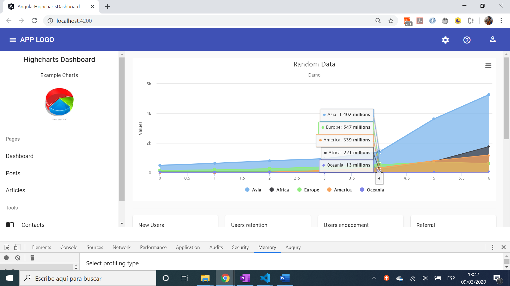
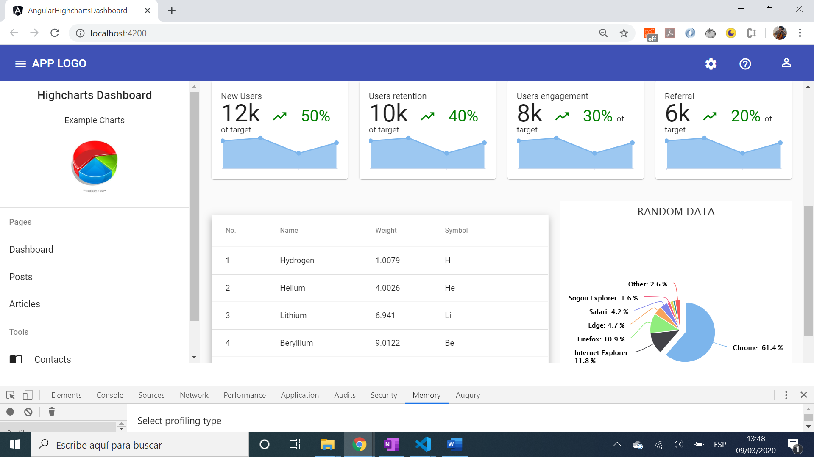

# :zap: Angular HighCharts Dashboard

Angular 10 app to show a dashboard with a selecion of chart types from [Highcharts](https://www.highcharts.com/). Much of code from [code-academia](https://www.youtube.com/channel/UCHDfCPdd_Q-OOcsujHB5-yA) to be expanded upon with different chart types etc.

*** Note: to open web links in a new window use: _ctrl+click on link_**

## :page_facing_up: Table of contents

* [:zap: Angular HighCharts Dashboard](#zap-angular-highcharts-dashboard)
  * [:page_facing_up: Table of contents](#page_facing_up-table-of-contents)
  * [:books: General info - Highcharts/Angular Chart Types](#books-general-info---highchartsangular-chart-types)
  * [:camera: Screenshots](#camera-screenshots)
  * [:signal_strength: Technologies](#signal_strength-technologies)
  * [:floppy_disk: Setup](#floppy_disk-setup)
  * [:computer: Code Examples](#computer-code-examples)
  * [:cool: Features](#cool-features)
  * [:clipboard: Status & To-Do List](#clipboard-status--to-do-list)
  * [:clap: Inspiration](#clap-inspiration)
  * [:envelope: Contact](#envelope-contact)

## :books: General info - Highcharts/Angular Chart Types

* [Pie Chart](https://www.highcharts.com/demo/pie-basic)
* [Stacked Area](https://www.highcharts.com/demo/area-stacked)
* [Angular Material Table](https://material.angular.io/components/table/overview)

## :camera: Screenshots




## :signal_strength: Technologies

* [Angular v10](https://angular.io/) latest version of JavaScript framework
* [Angular Material v10](https://material.angular.io/)
* [Angular Flex Layout v9](https://github.com/angular/flex-layout)
* [Highcharts v8](https://www.highcharts.com/)
* [highcharts-angular v2](https://github.com/highcharts/highcharts-angular) official minimal Highcharts wrapper for Angular

## :floppy_disk: Setup

* Install dependencies using `npm i`
* Run `ng serve` for a dev server. Navigate to `http://localhost:4200/`. The app will automatically reload if you change any of the source files.
* Run `ng build` to build the project. The build artifacts will be stored in the `docs` directory. Use the `--prod` flag for a production build.

## :computer: Code Examples

* extract from inialisation of pie chart page, showing chart options

```typescript
ngOnInit() {
    this.chartOptions = {
      chart: {
        plotBackgroundColor: null,
        plotBorderWidth: null,
        plotShadow: false,
        type: 'pie'
      },
      title: {
        text: 'PIE EATING DATA'
      },
      tooltip: {
        pointFormat: '{series.name}: <b>{point.percentage:.1f}%</b>'
      },
      accessibility: {
        point: {
          valueSuffix: '%'
        }
      },
      plotOptions: {
        pie: {
          allowPointSelect: true,
          cursor: 'pointer',
          dataLabels: {
            enabled: true,
            format: '<b>{point.name}</b>: {point.percentage:.1f} %'
          }
        }
      },
      exporting: {
        enabled: false
      },
      credits: {
        enabled: false
      },
      series: [{
        name: 'Brands',
        colorByPoint: true,
        data: this.data
      }]
    };
}

```

## :cool: Features

* Colourful chart types

## :clipboard: Status & To-Do List

* Status: Working.
* To-Do: Add comments, complete readme and customise with other chart types etc.

## :clap: Inspiration

* [code-academia: Angular 8 Admin Dashboard Panel from scratch using Angular Material, highcharts and flex-layout](https://www.youtube.com/watch?v=FP7Hs8lTy1k&t=47s)
* [Github repo: Angular Material Dasshboard using Angular Material, highcharts and flexbox](https://github.com/bloodymind/angular-material-dashboard)

## :envelope: Contact

* Repo created by [ABateman](https://www.andrewbateman.org) - you are welcome to [send me a message](https://andrewbateman.org/contact)
